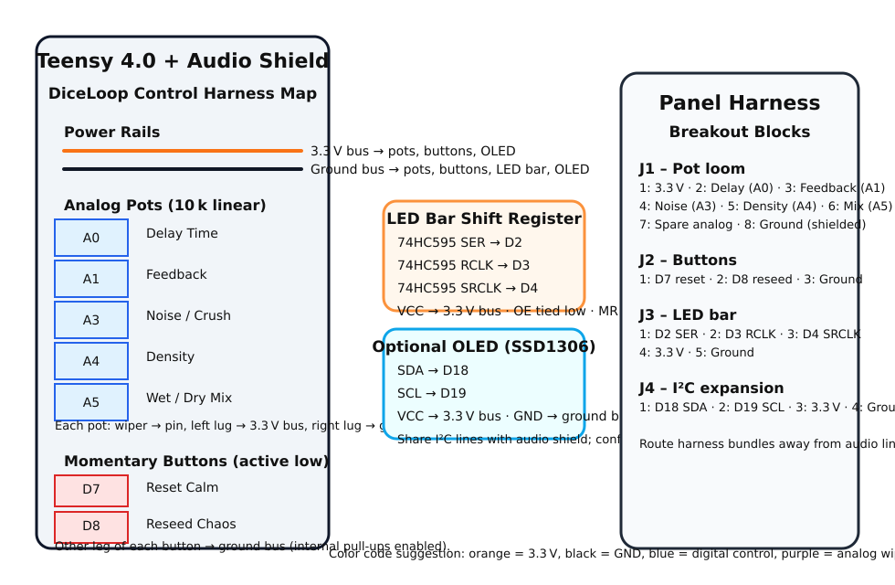

# DiceLoop – Chaos Delay for the Restless


This project straps a chaotic delay line onto a **Teensy 4.0** board and dares you to
feed it audio. Clean tones go in, fractured echoes come out. Every knob twist
and button jab nudges the randomness, so you're never standing in the same river
twice. Use it to learn how real-time DSP works, or just to make your synth sound
like it fell down the stairs. Think of the repo as a lab notebook where every
subsystem is annotated, diagrammed, and cross-linked so you can both perform and
reverse-engineer the trickery.

## Gear Checklist
- **Teensy 4.0** with the PJRC Audio Shield with input and outputs wired
- **Five 10k pots** wired like so:
  - `A0` – delay time
  - `A1` – feedback
  - `A3` – noise amount (bit‑crusher intensity)
  - `A4` – density (how often the glitches strike)
  - `A5` – wet/dry mix
- **Two momentary buttons**:
  - Pin `8` – reseed the chaos
  - Pin `7` – reset to calm
- **LED bar** driven through a shift register on pins `2`, `3`, and `4`
- **(Optional) I²C OLED** on the Teensy 4.0's default SDA/SCL (pins `18`/`19`). Any
  3.3 V-friendly 128×32 or 128×64 SSD1306 panel works.

<p align="center">
  
  <br />
  <em>Pots ride the analog bus (A0/A1/A3/A4/A5), buttons dive to pins 7 &amp; 8, the LED bar chews on D2–D4, and the optional OLED taps SDA/SCL on 18/19. Route the harness like this and nothing smokes.</em>
</p>

Pin assignments live in `src/controls.cpp` and `src/ui.cpp` so you can swap
hardware without spelunking the whole codebase.

## Signal Flow Snapshot

```
┌──────────────┐   Audio Shield I²S   ┌───────────────────────┐
│  Line / Mic  │ ───────────────────► │  filter1 (gentle HPF) │
└──────────────┘                      └──────────┬────────────┘
                                               │
                                               │      clean tap for manual mix
                                               ▼
                                   ┌───────────────────────────┐
                                   │ cleanQueueL / cleanQueueR │
                                   └──────────┬────────────────┘
                                              │
                                              │
                                              ▼
                                 ┌─────────────────────────┐
                                 │  feedbackMixer (4x1)   │◄──────────────┐
                                 └──────────┬──────────────┘               │
                                            │                              │
                                            ▼                              │
                                  ┌──────────────────────┐                 │
                                  │ delay1 (stereo taps) │────────────────┘
                                  └──────────┬───────────┘
                                             │
                                             │   post-delay capture for chaos
                                             ▼
                               ┌────────────────────────────────┐
                               │ queueL / queueR  (dirty tap)   │
                               └──────────┬─────────────────────┘
                                           │
                           chaos modulators│ feed offsets to ↓
                 reseed/reset ladder & pots │
                                           ▼
                 ┌────────────────────────────────────────────────────┐
                 │ processAudioQueues()                               │
                 │   ├─ blend clean tap + dirty tap                   │
                 │   ├─ Chaos Engine: processDirt()                   │
                 │   │     • bit crush core                           │
                 │   │     • wavefold smear                           │
                 │   │     • stutter / hold shards                    │
                 │   └─ trem/fuzz polish + mix routing                │
                 └──────────┬─────────────────────────────────────────┘
                             │
                             ▼
                   ┌────────────────────────────┐
                   │ outputQueueL / outputQueueR│
                   └──────────┬─────────────────┘
                              │
                              ▼
                            I²S out
```

The `processAudioQueues()` function drains the `queue*` buffers, lets the chaos
engine (`processDirt()`) chew on the dirty tap, blends that against the clean
feed with any offsets coming from the hidden modulators, and finally pushes the
mixed result into a pair of `AudioPlayQueue` nodes that ferry the audio straight
to the DAC. The ASCII diagram is rough, but the code comments mirror it
line-by-line so you can always map theory to firmware.

### Analog Front-End (Where the ADC actually lives)

There *is* an ADC in the loop—it just sits on the Teensy Audio Shield instead of
on the microcontroller. `AudioControlSGTL5000 audioShield` is now part of the
global rig inside `src/audio_pipeline.cpp`, and `setupAudioPipeline()` wakes the
codec, flips the input to **line in**, dials a sane gain, and leaves you with a
low-noise stereo feed ready for the chaos engine.

## Control Map & Chaos Knob Lore

These parameters are polled each loop and shoved straight into the audio path.
The comments in `src/controls.cpp` walk through every scaling decision and why
the chosen ranges work on Teensy 4.0 (3.3 V reference, 10-bit ADC, etc.).

| Physical control | Teensy pin | Firmware symbol | Range & behaviour |
| ---------------- | ---------- | --------------- | ----------------- |
| Delay pot        | `A0`       | `delay1.delay`  | Four-scene macro: dead-dry stop, 0–300 ms slapback, ghost-voice crossfeed, bloom limiter |
| Feedback pot     | `A1`       | `feedbackAmount`| 0.00 – 1.00 linear gain into feedback mixer |
| Noise pot        | `A3`       | `noiseAmount`   | 0 – 60 → maps to 2–8 bit resolution in crusher |
| Density pot      | `A4`       | `density`       | 0 – 100% chance that a sample is crushed |
| Mix pot          | `A5`       | `mixAmount`     | 0.00 – 1.00 dry/wet crossfade |
| Reseed button    | `8`        | chaos ladder    | Adds +5 bits of nastiness per press until clamped |
| Reset button     | `7`        | chaos ladder    | Slams everything back to polite defaults |

The chaos ladder is intentionally dramatic: each reseed press ratchets both the
bit crushing depth and the glitch density, while also reseeding the RNG from an
analog pin so the statistical flavour changes in a way you can actually hear.

**Delay pot macro map**

- **0 – 5 %** → bypass. The firmware forces the mix dry and parks both delay taps
  at zero so you can cue phrases without the buffer lurking.
- **5 – 33 %** → slapback accelerator. A quadratic curve rockets from
  ~10 ms to ~300 ms, making the first third of the travel feel like a tight
  tape echo.
- **33 – 66 %** → ghost voice. The second tap wakes up, offset a few hundred
  milliseconds behind the main buffer, and crossfeeds between channels so the
  tail ping-pongs instead of just stacking louder.
- **66 – 100 %** → bloom. The mix leans wetter, a limiter-style swell clamps the
  return, and the feedback loop gets a gentle shove so the repeats flare without
  self-oscillating (unless you *want* that and crank the feedback pot anyway).

`src/audio_pipeline.cpp` handles the mixing and dirt engines while
`src/controls.cpp` maps the knobs and buttons to those globals. It's all plain
C++ and Arduino APIs—poke around and hack it.

### Status Display Playground

The old LED bar is still the quick-look chaos meter, but there is now room for a
tiny OLED to narrate what the dirt engines are doing in real time. Wire any
SSD1306 panel to SDA/SCL (pins `18`/`19`) plus 3.3 V and ground, then enable the
firmware support with:

```ini
; platformio.ini
build_flags =
  -DDICELOOP_ENABLE_OLED=1
  ; optionally override geometry:
  ; -DDICELOOP_OLED_WIDTH=128
  ; -DDICELOOP_OLED_HEIGHT=64
  ; -DDICELOOP_OLED_ADDRESS=0x3C
```

Once flipped on, `renderStatusUI()` paints live readouts for mix, feedback,
noise, density, and the modulation offsets coming back from
`latestChaosSnapshot()`. The final line shows how hard the chaos modulators are
tugging on the mix/feedback/fuzz trio, and the mini meters on the right keep the
values legible even when you're playing in the dark. Skip the macro and the code
compiles down to the same LED-only firmware as before.

### Dirt Engine Anatomy

`processDirt()` now juggles three little DSP gremlins instead of a single
bit-crusher:

- **Bit crush core** – The OG reduction to 2–8 bits still anchors the sound and
  tracks the `noiseAmount` pot.
- **Wavefold smear** – A sine-based fold keeps harmonic chaos musical. The fold
  accumulates into a short memory buffer so micro-movements of the knobs or
  chaos ladder read as motion instead of clicks.
- **Sample-and-hold stutter** – Density steers how quickly the engine freezes
  and relaunches audio grains. Slow sweeps feel like a dying tape deck; full
  tilt becomes digital chopper heaven.

Those outputs are blended on-the-fly and then handed to a slow tremolo and a
touch of controlled fuzz. The knobs stay expressive because each axis hits a
different part of the engine: `noiseAmount` sculpts harmonic teeth, `density`
nudges the rhythmic edits, and the chaos ladder reseeds the whole mess so it
never loops in place. Crack open `src/audio_pipeline.cpp` to study the math—it's
annotated so you can rip out pieces or wire in your own machines.

### Optional Chaos Modulators

Feeling brave? Hold both buttons at once to flip a hidden switch that lets a
pair of modulators ride shotgun with your knob moves. The reseed button + reset
button chord calls into `toggleChaosModulators()` and prints the new state over
serial so you always know whether the gremlins are active.

- **Mix sway** – A slow LFO nudges the wet/dry balance. Higher density means
  faster swings, so glitch hurricanes get a little extra motion.
- **Feedback drift** – A logistic-map driven offset leans the feedback mixer in
  and out of danger. It stays clamped between polite and “about to howl” so you
  can feel the tension without blowing speakers.
- **Fuzz wobble** – The fuzz amount inside `processDirt()` gets a breathing
  multiplier tied to the noise pot. Crank the noise and the grit pulses like a
  busted power rail.

All of that logic lives in `src/chaos.cpp`. The modulators stay dormant until
you ask for them, so conservative players can keep the box tight while everyone
else gets an extra dimension of instability on command.

### Teaching Notes

- **Signal levels:** The Teensy audio library pushes 16-bit signed integers in
  the range ±32767 inside `audio_block_t`. The comments in `processAudioQueues`
  spell out the conversion math so you can swap in your own fixed-point tricks.
- **Why the filter first?** `filter1` is configured as a gentle high-pass to
  keep DC out of the delay feedback path. A low, sticky offset will otherwise
  cause the delay to saturate. Change the frequency/resonance in
  `setupAudioPipeline()` and hear the difference.
- **Probability-based glitching:** `density` is interpreted as a % chance that
  we crush the current sample. This keeps the behaviour simple and makes it
  easy to swap in other distributions (Gaussian, correlated noise, etc.).
- **Feedback safety:** The explicit `constrain()` calls keep the feedback loop
  from rage quitting. Yank them if you want full self-oscillation, but do it
  intentionally.

## Build & Flash
Built with [PlatformIO](https://platformio.org/). From the repo root:

```sh
pio run          # compile
pio run -t upload  # flash it to the board
```

`platform.ini` already targets the Teensy 4.0, so the above is enough to get
code onto the hardware.

### Continuous Integration Safety Net

> **Note:** All of the real analog-to-digital work happens inside the SGTL5000
> codec on the Teensy Audio Shield. `setupAudioPipeline()` now explicitly wakes
> the chip, routes the **line in** pair to the delay graph, and leaves the MCU's
> bare-metal ADC powered down. That silicon (and the PJRC `input_adc.cpp`
> module) targets the older Kinetis parts, so we ship an `extra_script`
> (`scripts/disable_audio_adc.py`) that snips it out before PlatformIO wastes
> cycles compiling code we never call. The Teensyduino toolchain bundles a
> modern Audio library that already speaks IMXRT, so we lean on the copy PJRC
> ships with Teensyduino instead of yanking an older, Kinetis-only archive from
> the PlatformIO registry. Keeping the dependency list short means CI and local
> builds share the exact toolchain PJRC tests. If you crave the breadboard-friendly
> on-chip ADC, reach for a Teensy 3.x or port the driver to i.MXRT and ditch the
> script.

> **Heads up:** The first `pio run` after cloning will pull in the entire
> [PJRC Audio library](https://www.pjrc.com/teensy/td_libs_Audio.html). Expect a
> minute or two. Future builds are quick.

### Static Analysis Reality Check

Running `pio check -e teensy40` pumps your code through **cppcheck** as well as
several Arduino-specific linters. The report is loud because it scans every
vendor dependency living under `.pio/libdeps/teensy40/Audio/`. Most of the
“missing return” and “member not initialised” diagnostics come from the upstream
PJRC Audio library and are outside this repo’s control. They are already proven
in hardware, so we treat them as known noise.

What actually matters for DiceLoop lives in `src/`. At the moment cppcheck only
complains about a handful of helper functions (`processAudioQueues()`,
`setupAudioPipeline()`, `setupChaos()`, etc.) that sit idle because the
experimental control surface isn’t wired up in `main.cpp` yet. If you wire those
features back in, the warnings disappear. Until then, the functions remain in
place as documentation and ready-made hooks for future builds.

**TL;DR:** when you run the check, skim the output but focus on paths inside
`src/`. Vendor noise can be safely ignored unless you decide to fork the audio
library and fix upstream.

## Repo Tour
- `src/` – firmware sources: `main.cpp`, `audio_pipeline.cpp`, `controls.cpp`,
  `ui.cpp`, `chaos.cpp`
- `include/` – headers shared across those files
- `rough/` – early Arduino sketch kept for historical kicks

## Study Pointers & Further Reading

- [Teensy Audio System Design Tool](https://www.pjrc.com/teensy/gui/index.html)
  – Drag blocks, wire them up, and export Arduino code. Compare the generated
  code to our hand-crafted setup in `src/audio_pipeline.cpp`.
- [PlatformIO Teensy Docs](https://docs.platformio.org/en/latest/boards/teensy/teensy40.html)
  – Explains the board configuration you inherit via `platform.ini`.
- [Bit crushing primer](https://ccrma.stanford.edu/~jos/filters/Bit_Reduction_Distortion.html)
  – Stanford CCRMA notes on what actually happens when you nuke bit depth.
- [Finite state machine for buttons](https://www.ganssle.com/debouncing.htm)
  – Want to replace the naive `delay(50)` debounce? Start here.

## Contributing / License
I learned every trick and quick bitshift from others who were kind enough to share.
Please use this, but make that use build others.

MIT License

Copyright (c) 2025 BSSS project team

Permission is hereby granted, free of charge, to any person obtaining a copy
of this software and associated documentation files (the "Software"), to deal
in the Software without restriction, including without limitation the rights
to use, copy, modify, merge, publish, distribute, sublicense, and/or sell
copies of the Software, and to permit persons to whom the Software is
furnished to do so, subject to the following conditions:

The above copyright notice and this permission notice shall be included in
all copies or substantial portions of the Software.

THE SOFTWARE IS PROVIDED "AS IS", WITHOUT WARRANTY OF ANY KIND, EXPRESS OR
IMPLIED, INCLUDING BUT NOT LIMITED TO THE WARRANTIES OF MERCHANTABILITY,
FITNESS FOR A PARTICULAR PURPOSE AND NONINFRINGEMENT. IN NO EVENT SHALL THE
AUTHORS OR COPYRIGHT HOLDERS BE LIABLE FOR ANY CLAIM, DAMAGES OR OTHER
LIABILITY, WHETHER IN AN ACTION OF CONTRACT, TORT OR OTHERWISE, ARISING FROM,
OUT OF OR IN CONNECTION WITH THE SOFTWARE OR THE USE OR OTHER DEALINGS IN
THE SOFTWARE.
